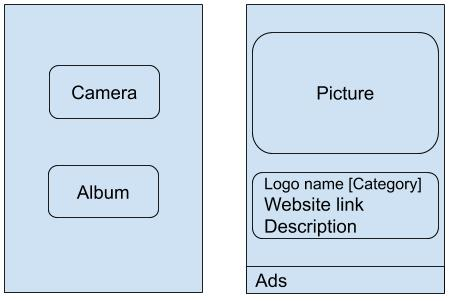

# Logo Recognition - Need-finding

## Abstract

## Introduction (problem space, user type)

## Needfinding Plan 1: Observation

Concentrate on collecting data including but not limited to:

1. What is users major motivation when they need to recognize logo?
2. What is the exist approach to recognize logo?
3. What is the cost (money/time) of the approaches?
4. When a user is unable to recognize a logo, do they have backup plan. If so, how often will they be satisfied by the backup plans.

## Needfinding Plan 2: Interviews

### User selection
1. Age range: 20-70
2. Education: High school and above
3. Avoid only interviewing same type of people. 

### Initial script:
1. Greeting and brief intro to the interview
2. Get to know the user: background and occupation, etc
3. In what situation will you want to find out a logo's name.(Three example)
4. How often do you need to search for the meaning of a logo.
5. What approach do you use to search for the meaning of a logo.
6. How much time or money does it usually take to search for a logo.
7. If you are unable to recognize a logo, will you just ignore it or you will do something else to bypass the logo recognition. If there is a app that can recognize a logo, will you keep the app or feel that it is not helpful.

## Execution 1: Observation

## Execution 2: Interviews

### User 1
Age:

Education:

<!--
## Needfinding Plan 3: Experiment
-->

## Summary

## Prototype

 

Some textual explanations are given as follows:

1. There are two pannels. In the first pannel, there are two icon. One is "From camera", one is "From album." The first pannel is used to input the data(picture)
2. The second pannel is used to show the results, includes name of the logo, category, website link. 
3. In the backend, we first transform picture to a vector. Then use classificaiton model to find the corresponding logo name and its related information.

## Evaluation Plan

### Content of evaluation
We evaluate the prototype based on the following contents:

1. Is this prototype easy to use?
2. Can the prototype satisfy all the users requirements?

### Evaluation method
We use interview to see whether a user is satified with our protorype. The script of the interview is shown as follows:

1. Greeting and brief intro to the prototype.
2. Ask them whether the process is difficult or redundent to them.
3. Ask them what features do they think should also be added.
4. Get to know the user: background and occupation, etc

